# TP2: Value iteration

## Value Iteration Algorithm

The Value iteration algorithm assumes knowledge of the underlying MDP. The Value Iteration algorithm applies Bellman equation iterations to update value estimations of different states according to the agent's policy, while optimizing the policy. The differs from the Policy Iteration algorithm which separates the two steps of estimating the value function for a give policy then optimizing the policy.

The Value iteration algorithm has one hyperparameter: the discounting factor $\gamma$.

## Environement: Gridworld

In this report, we use `gym` and Gridworld. The agent navigates a 2D world trying to maximize rewards while getting out of the map as soon as quickly as possible.

## Bellman iteration convergence

Bellman iterations are costly. At each iteration, the Bellman operator updates the value of each state for every action and possible transition. Thus, it is interesting to verify that the algorithm converges with few iterations.

The algorithm converges (see proof in course), so we can use a `tol` stopping criterion that tests the absolute difference between two different value tables.

The Value Iteration does indeed converge very quickly, in around 10 iterations. Note that while the optimal policy can be found very quickly, the difference between successive Value tables will go to zero very quickly. Thus the tolerance parameter has to be chosen well.

This is illustrated in the following plots:

| Policy convergence |  Bellman convergence | 
|---|---|
| 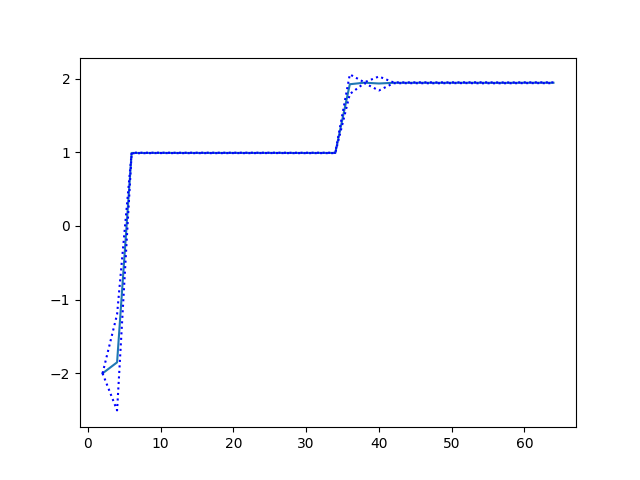{ width=50% }  |  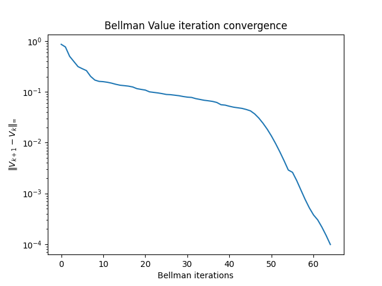{ width=50% } |

## Effet de $\gamma$

$\gamma$ determines how much we privilege the present over the future. We check how learning behaves over different values of $\gamma$. It is interesting to note that for small $\gamma$, the iterations seem to converge more quickly. However, they do not converge well in policy.

| Policy convergence |  Bellman convergence | 
|---|---|
| 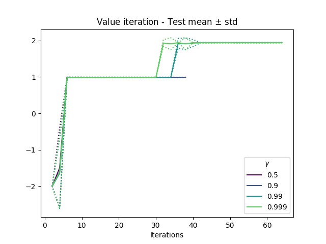{ width=50% }  |  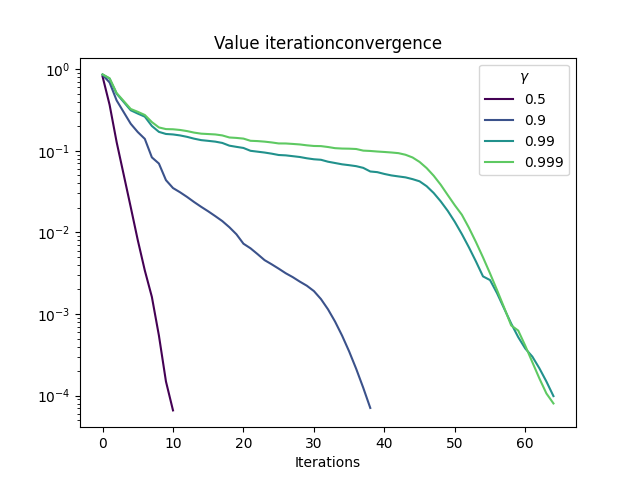{ width=50% } |

## Performance sur différentes cartes
| Maps |
|---|
| 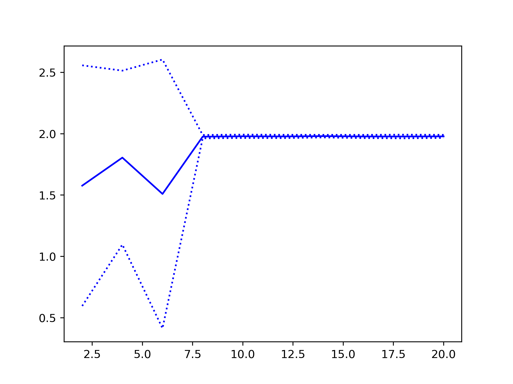{ width=50% }  |
| 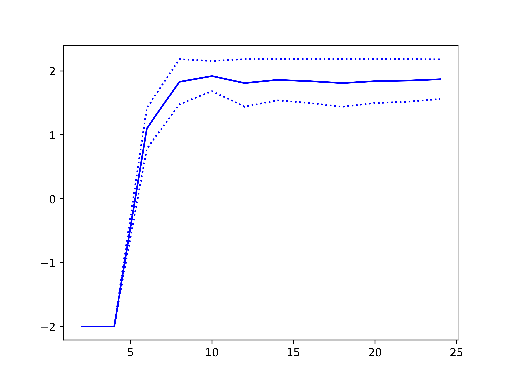{ width=50% }  |
| 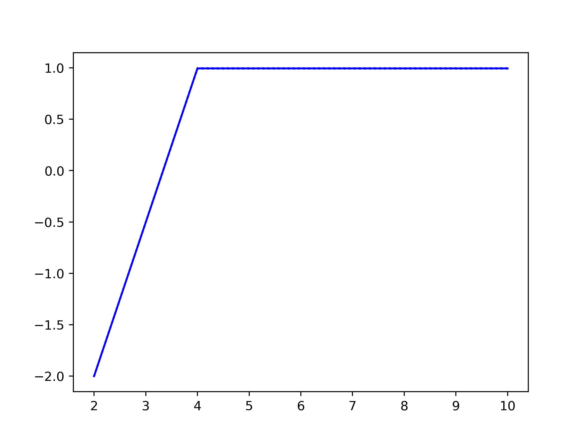{ width=50% }  |
| 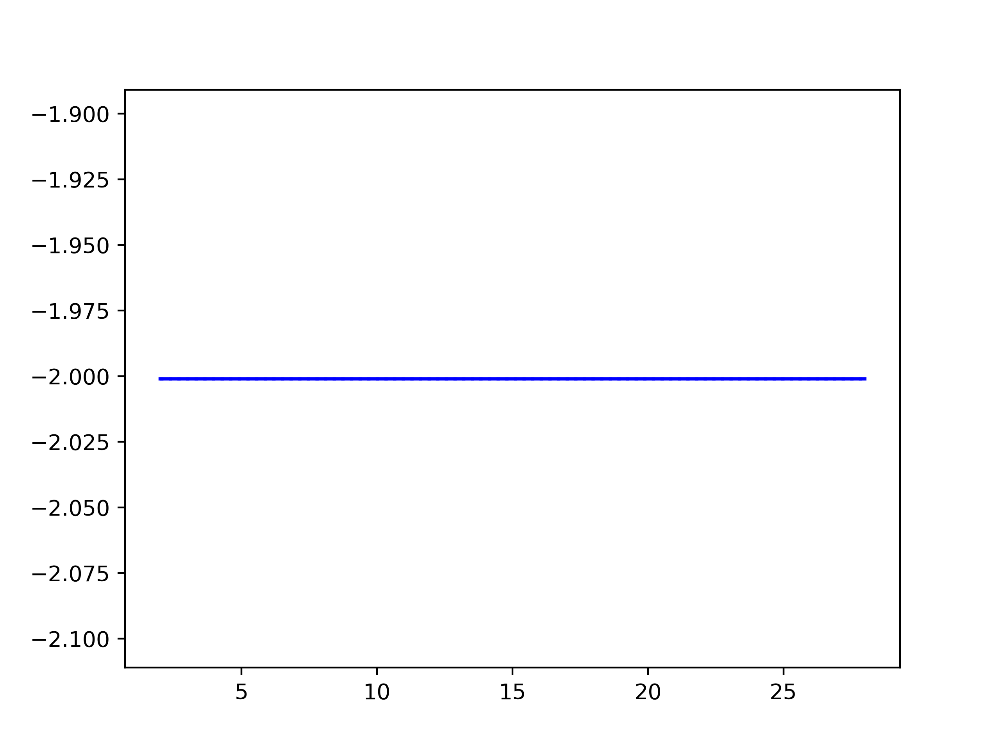{ width=50% }  |
| 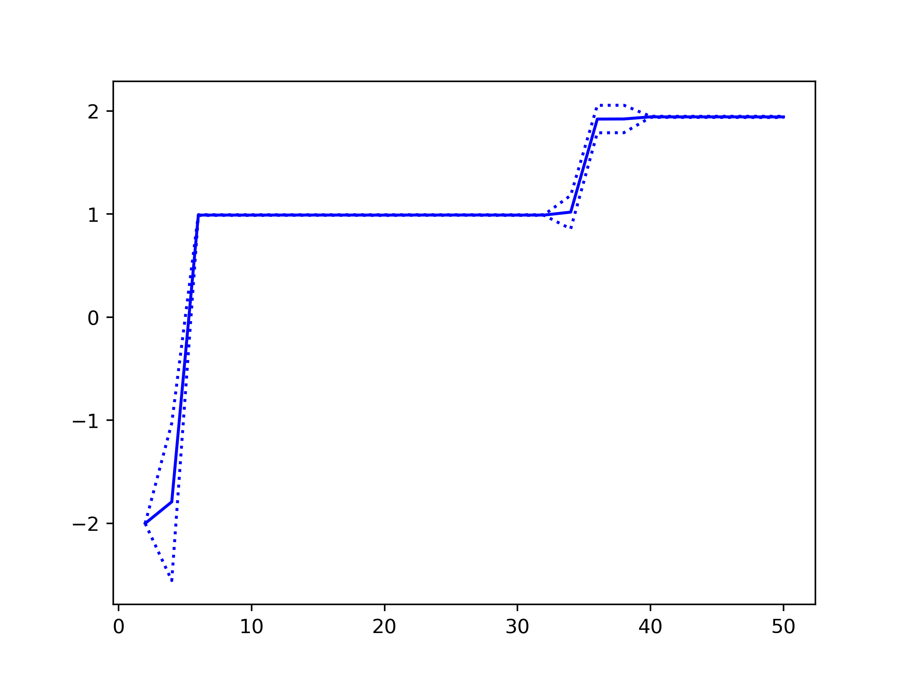{ width=50% }  |
| 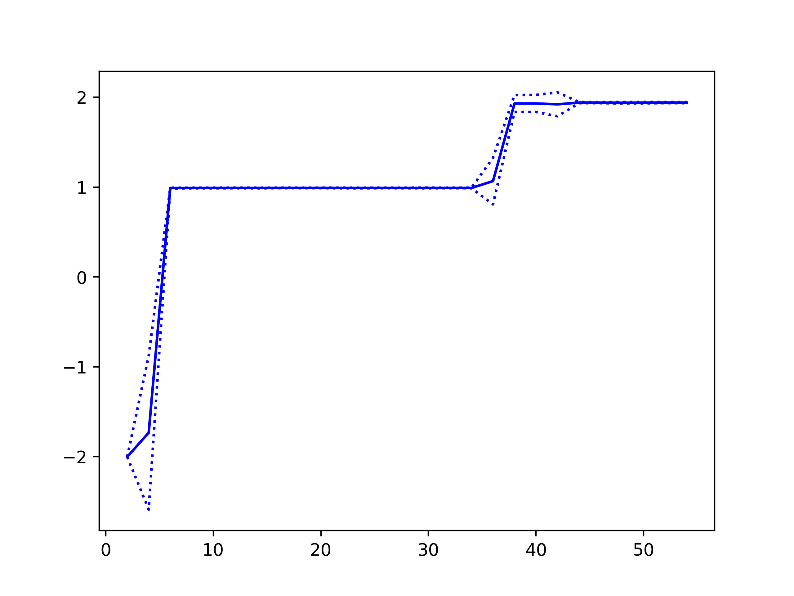{ width=50% }  |
| 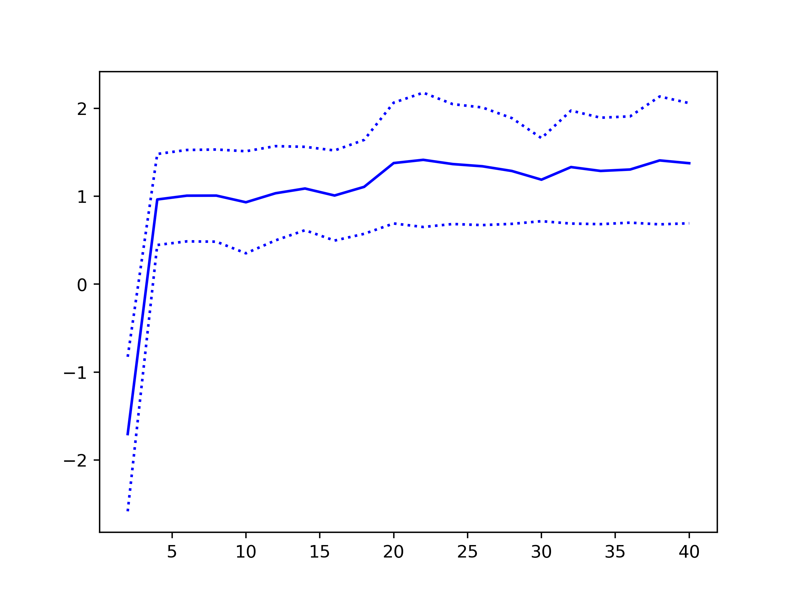{ width=50% }  |
| 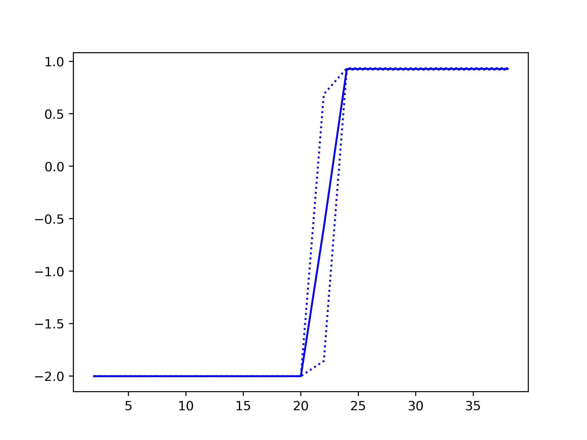{ width=50% }  |

Note that in each case, the agent does not necessarily attain the maximal possible rewards. It is difficult to tune the agent since there is only one degree of freedom ($\gamma$). The above experiments are for $\gamma=0.99$.

We'll see more expressive and efficient agents in the following reports.
