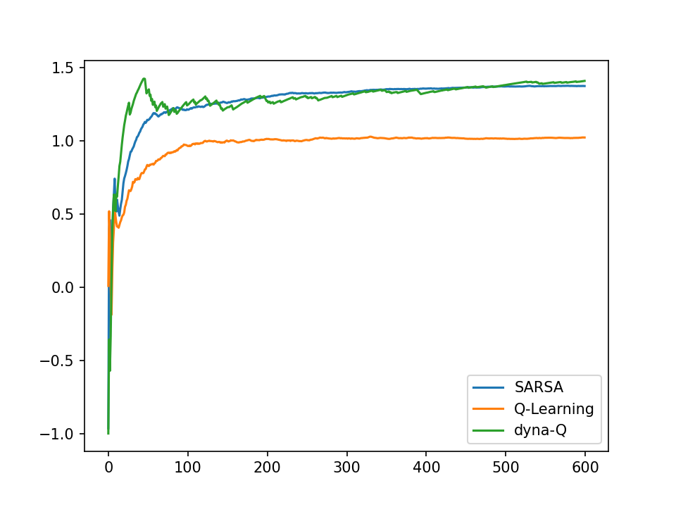
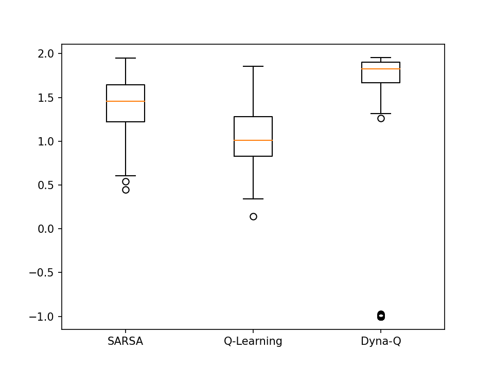
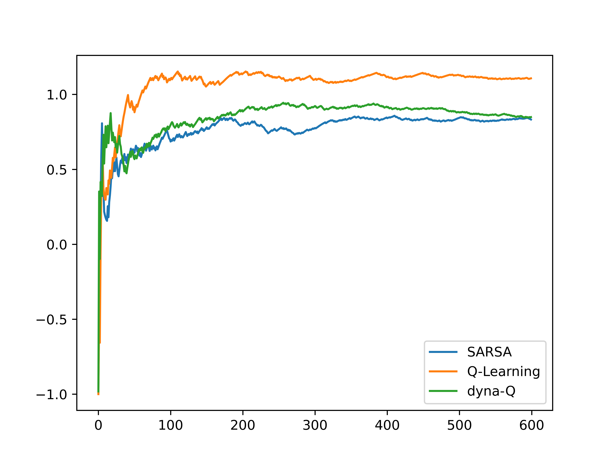
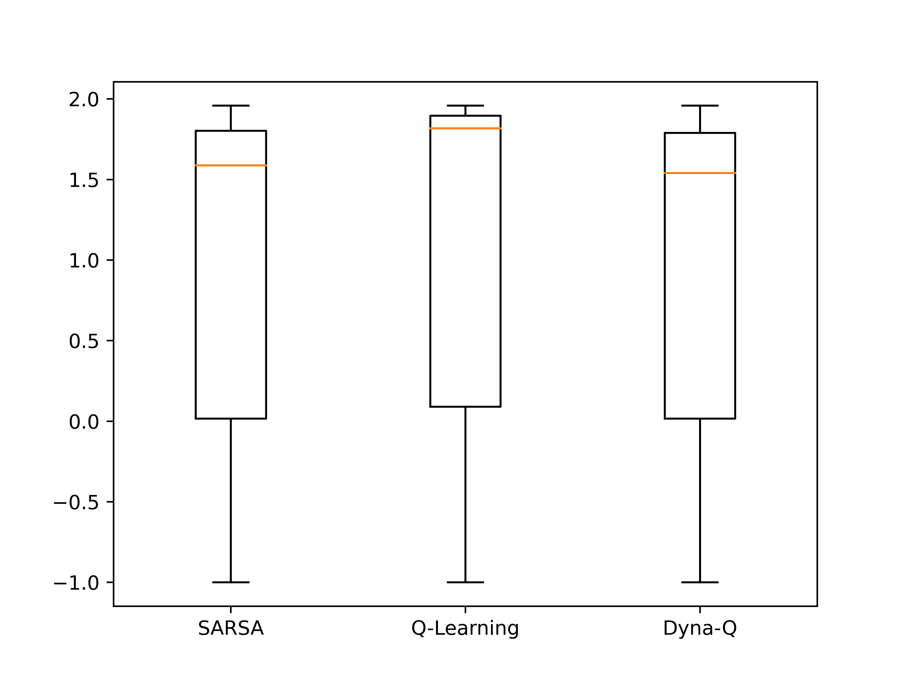

# TME #3: Q-Learning & variants

## Algorithms

The goal of Q-Learning and SARSA is to learn the $Q$ function, when the MDP is unknown (contrary to Value iteration).

Q-Learning is off-policy, whereas SARSA in on-policy. However, both learn _online_: at each transition, the transition is used to learn.

We implemented another variant, Dyna-Q, which aims to simultaneously estimate the MDP (this agent in hybrid-model and value-based).

## Exploration strategy

Because the MDP is unknown, Q-Learning agents face the exploration-exploitation dilemma. The approach in Q-Learning is to use an exploration behavior to sample the next action. To reiterate the difference between SARSA and Q-Learning: in Q-Learning, the behavior is used to sample the next action, but not the action in the TD residual, while the behavior is always used in SARSA.

We use two different exploration strategies:

* Epsilon-greedy: with probability $\varepsilon$, the agent explores uniformally at random instead of choosing the optimal action according the $Q$ function.
* Boltzmann sampling: a tempered softmax is applied to $Q(s, \cdot)$ and the action is sampled from this distribution.

The main advantage of Boltzmann sampling is that exploration is not at random but only relatively high value states are explored. This makes learning "safer" but makes exploration more difficult as the Q function converges.

## Experiments

We present learning curves over time, as well has results for testing the agents.

|   Learning curves (average cumulative rewards) |  Test performance | 
|---|---|
| Strategy: Boltzmann. Map: 1. | toto |
| { width=50% }  |  { width=50% } |
| | Note that Dyna-Q produces a better average return |
| | but with outliers. |
| Strategy: Epsilon-greedy ($\varepsilon=0.1$). Map: 1. | |
| { width=50% }  |  { width=50% } |
| Note that Q-Learning converges better | Note the high variance.|
| when it can explore more.| |

In general, the Boltzmann strategy performs better, and Dyna-Q and SARSA have better performance.

### Runtime complexity

It is important to note that while Q-Learning and SARSA and computationally efficient, Dyna-Q requires 30 times more time to learn over the same number of episodes.

