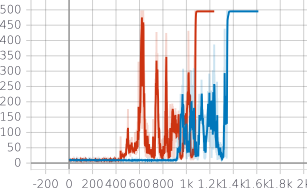
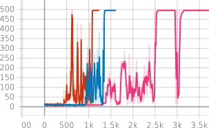

# TME #4: Deep Q-Learning (DQN)

## Algorithms

Like Q-Learning, Deep Q-Learning aims to learn the $Q$ function when the MDP is unknown.

In this TME, we rely on the epislon-greedy strategy.

## Model

We use a neural network with 2 hidden layers of size 24 to approximate $Q$, which we learn using SGD with constant learning rate. We noticed that using Adam was less reliable than plain SGD. This may be due to the fact that Adam has adaptive learning rates for its coordinates, which strong convergence is needed in Q-Learning since the policy is derived from it. Note: this will also motivate the use of Policy Gradient methods.

We employed a target network, changing every 100 episodes.

In a variant, we implemented a Prioritized Experience Replay version of the method. However, this method has a much longer runtime and seems to make learning more difficult.

## Experiments

We present learning curves over episodes, for different hyper parameters.

|   Learning curves |  Hyperparameters | 
|---|---|
| { width=50% }  |  Blue: $\mathrm{LR} = 0.05, \varepsilon=0.005$|
||Red: $\mathrm{LR} = 0.05, \varepsilon=0.05$ |

Changing the target less often tends to make the agent converge less quickly:

|   Learning curves  |  Hyperparameters | 
|---|---|
| { width=50% }  |  Blue, Red: as above.|
||Pink: same HP but change every 1000.|

### Handling truncated episodes

The Cartpole environment truncates episodes at 500 steps, returning `done = True` that has a different meaning than when the agent fails mid-episode. We handle this cas checking if the environement truncated the episode and setting `done = done and (not truncated)` in the playback buffer.

