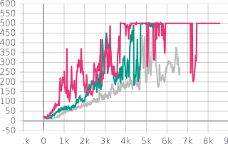
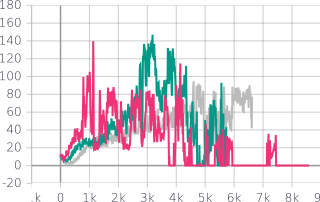

# Actor-critic algorithm

Actor-critic algorithms are a sub-family of policy gradients. In addition to directly learning the policy function $\pi$, we also learn a baseline, the critic, $V_\phi$ which approximates the state value function.

We implement the A2C version, which is on-policy.

## Model

$\pi$ and $V_\phi$ are implemented as neural networks with ReLU activation and 2 hidden layers. We implement a target critic $V_\phi^-$.

We fit the critic with the Huber loss to avoid too large gradients. We fit the actor by doing gradient descent on $J$, via the policy gradient theorem. For both cases, a target is determined to fit $V_\phi$ and $\pi$ to. In the case of the actor, it is called the advantage function. We implement three variants, which are presented below.

## Advantage functions

We implement three variants of the advantage function:

### TD(0) residual

This advantage is computed using a single transition (whereas the following methods concern a complete episode trajectory).


### Monte-Carlo rollout

This advantage is computed as the full returns on the transition for the trajectory. It relies on the discount factor $\gamma$.

The relevant code snippet is:
```python
returns = 0
for backstep in range(1, step_count + 1):
    reward = batch[-backstep][3]
    batch[-backstep][4] = returns + reward
    returns = agent.gamma * (reward + returns)

```

### Generalized Advantage Estimation

This advantage consitutes a middle-ground between the biased TD(0) residual and the Monte-Carlo rollout approach, which has high variance. It is parametrized by $\lambda$, an additional discount factor, which controls how far back the return is estimated.

When $\lambda=0$, we recover TD(0) and when $\lambda=1$, we recover Monte-Carlo rollout.


The relevant code snippet is:
```python
returns = 0
for backstep in range(1, step_count + 1):
    reward = batch[-backstep][3]
    state = batch[-backstep][0]
    next_state = batch[-backstep][2]
    done = batch[-backstep][5]

    td = (
        reward
        + (1 - done)
        * agent.gamma
        * agent.V_nn_target(torch.from_numpy(next_state).float())
        .detach()
        .squeeze()
    )
    lambda_returns = agent.lambd * agent.gamma * returns
    batch[-backstep][4] = td + lambda_returns
    returns = (
        lambda_returns
        + td
        - agent.V_nn_target(torch.tensor(state).float()).detach().squeeze()
    )
```

## Experiments

An A2C agent learns by optimizing two cost functions which are coupled. Thus, there is some competition between actor and critic convergence. We monitored the following quantities in Tensorboard:

* the value of the actor "loss" before gradient computation (which does not correspond to any quantity in RL) to check that it decreases
* the magnitude of the gradients of the actor loss.
* the value of the critic loss (the error between the target and the critic) 
* the magnitude of the critic gradients.
* the estimated entropy over the policy. This is important to detect if the policy converges to a deterministic policy too quickly (see competition).

Of course, we also monitor rewards gained as learning progresses, as well as the standard deviation.

We do not present all metrics for the experiments below but focus on some key insights into our A2C implementation:

1. Interpolation of $\lambda$ between 0 and 1: a bias-variance trade-off
2. Stability of methods
3. Strong uncertainty in runs (while $\pi$ converges)

### 1. Bias-variance tradeoff: varying $\lambda$ between $0$ and $1$

As mentioned above when we vary $\lambda$ between 0 and 1 we interpolate between TD(0) and Monte Carlo roll out.

This can be seen in the following figure where for the pink curve $\lambda = 0.84$, for the green curve, $\lambda = 0.5$, and for the grey curve $\lambda = 0$. The grey curve is longer to converge (bias) but has lower variance than the other two.

|   Learning curves (mean) | (std dev) | 
|---|---|
| { width=50% }  | { width=50% }  |  |


### 2. Stability of A2C

With respect to DQN, A2C seems to be much more stable. For DQN, many hyperparameter combinations fail to learn anything (staying at return = 10 indefinetly) whereas for A2C although hyperparameters have an effect, they are less critical.

### 3. Strong uncertainty in runs

By monitoring the standard deviation of test returns as the agent learns, we observe that up until convergence (in Cartpole) there is large spread in different test episodes. Indeed, the standard deviation attains 150! See the figure above.
