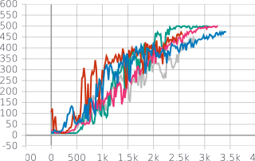
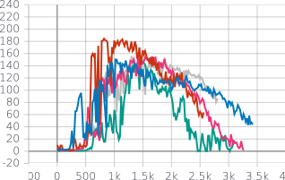
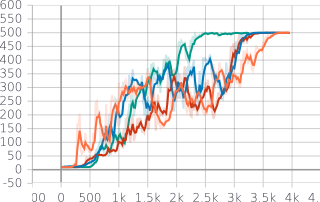
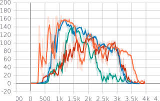
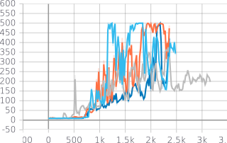
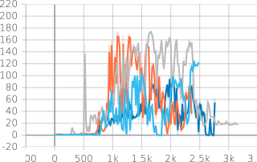

# TME # 6: Proximal Policy Optimization

The main idea behind PPO is to limit the magnitude of gradient steps in policy space in order to avoid catastrophic steps. The cliff-walking analogy comes to mind.

Two variants exist: 

* a KL divergence penalized version 
* a clipped objective variant.

The Clipped objective variant is easier to implement and is more stable. We focus on this one in our report.

## Algorithm

Similarly to A2C, we estimate the policy gradient using a batch of transitions. We then take $K$ steps of gradient ascent (with $K=10$). The policy gradient objective is clipped to protect against overfitting to the batch (i.e. changing too much is policy space). 

## Experiments

Although the clipped objective theoretically guards against too large gradient steps, in practice, we find it is better to keep $K$ small. We find PPO to be much less stable than A2C in learning. Indeed, despite small learning rates (with Adam) it has trouble converging. Furthermore, it is very seed-dependent. As we

Our base implementation uses the following hyperparameters: $K=4$, $\varepsilon=0.01$, $PI_LR = 0.0001$, $V_LR = 0.001$, changing the target every 10 episodes.

### Seed dependence

The following figure illustrates the seed dependence : 5 runs are displayed with 5 different seed values. Note the variance between seeds.

|   With TD(0): Learning curves (mean) | (std dev)| 
|---|---|
| { width=50% }  | { width=50% } |

The results are similar with GAE. The green curve is TD(0) for reference.

|   With GAE: Learning curves (mean) | (std dev)| 
|---|---|
| { width=50% }  | { width=50% } |

### Instability

In the following figures, we can see how PPO learning can be unstable, if the choice of hyperparameters is not good. In particular, if the policy update is not well enough protected -- that is, if $\varepsilon$ or $K$ are too large -- then the policy does not converge well (for example, it does not attain 500 consistently, but falls back down).

|   With GAE: Learning curves (mean) | (std dev)| 
|---|---|
| { width=50% }  | { width=50% } |
