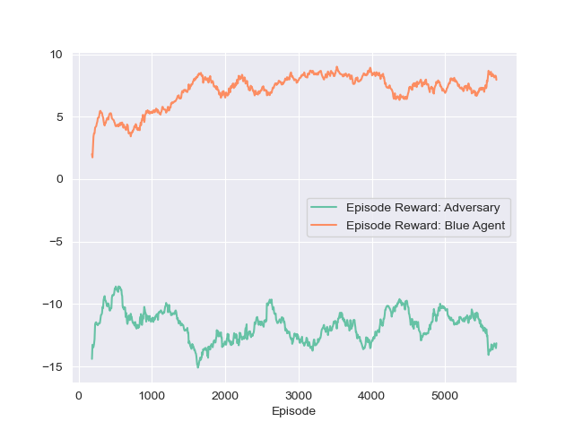
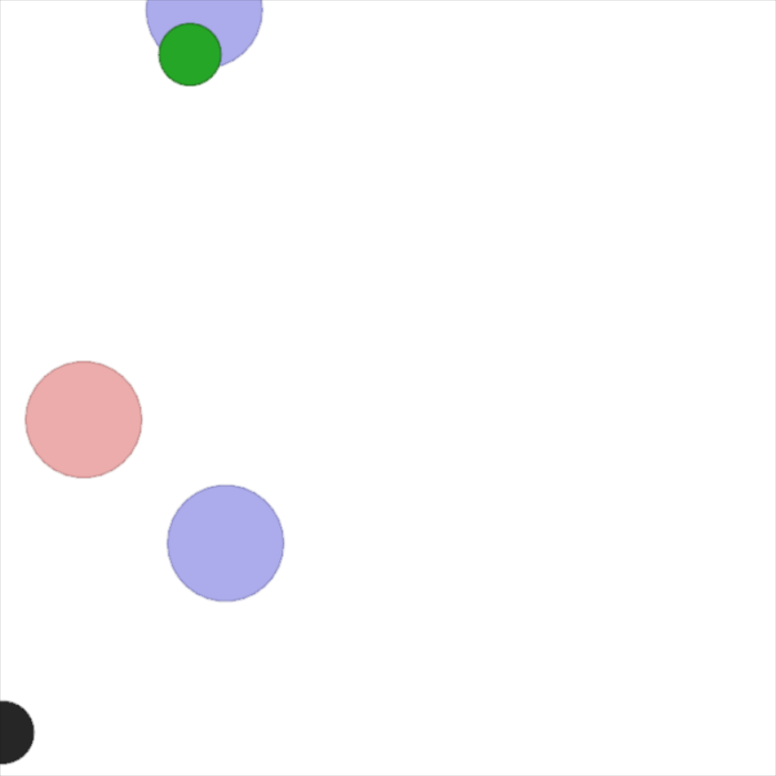

# TME #10: Multi-Agents RL

In this TME, we experiment with Multi-Agents Reinforcement Learning via the MADDPG algorithm. MADDPG is a centralized critic, decentralized actor learning method for environments with multiple agents. It maintains an actor and critic network for each agent, and individual critics are conditioned on the other agents' actions: this ensures that the underlying transition probabilities remain stationary.

To update our buffer, we create a new `MultiAgentMemory` class to store all our agent's transitions. We use the same training loop structure as for DDPG algorithm, and iteratively update all our agent's critics and actors every 10 actions. To compute the target updates of our critic networks, we maintain target critic and actor networks, whose weights are updated at each optimization step with a polyak average ($\rho = 0.9$).

We train our MADDPG algorithm on 3 environments: a cooperative `simple_spread`, and two aversary settings: `simple_adversary` and `simple_tag`. We train until convergence on episodes of 25 frames, and test our model every 100 episodes on 100 frames. We report the evolution of the reward here:

On `simple_spread`, all agents are identical, and receive the same reward proportional to the distance to the nearest base. The reward does not converge within 6000 episodes, but the behaviors of the agents are already satisfying. We plot the evolution of the reward (identical for all agents).

|**Figure**: Evolution of the reward. Smoothed over 100 episodes. | **Image**: Last (100th) frame, after 1K episodes| **Image**: Last (100th) frame, after 5K episodes|
|---|---|---|
|   |    |    |

On `simple_adversary`, the two cooperative agents' reward progressively increase to convergence (around $10$), while the adversary tends to oscillates around the same value (around $-10$), signaling the learning of a successful cooperation strategy by the two formers.

|**Figure**: Evolution of the reward. Smoothed over 100 episodes. | **Image**: Last (100th) frame, after 1K episodes| **Image**: Last (100th) frame, after 5K episodes|
|---|---|---|
|   |    |    |

The cooperating agents first learn to go toward the green target (*Figure 1*), thus providing information to the adversary about its location. After 4K episodes (*Figure 2*), the adversary starts to learn to follow the blue agent around to maximize its reward. Finally, the cooperating agents learn to cover both bases to maximize their rewards.